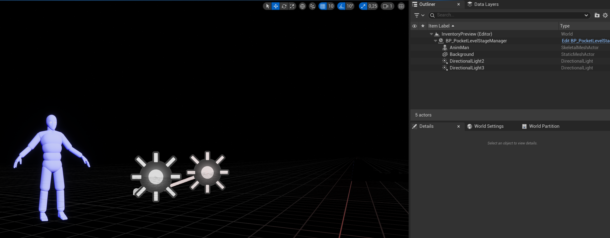
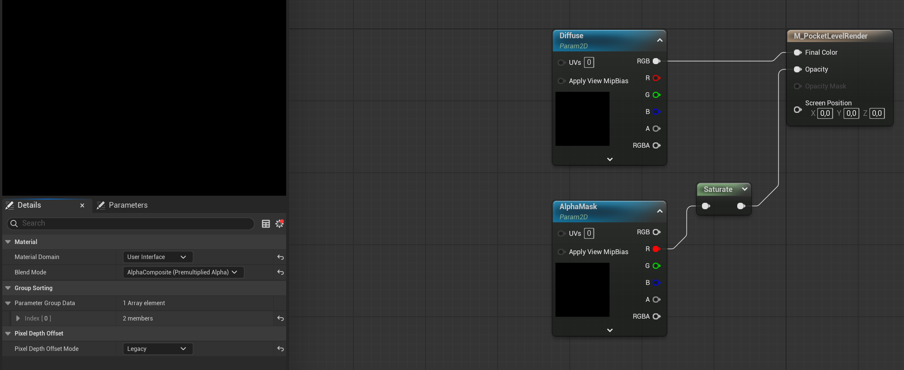
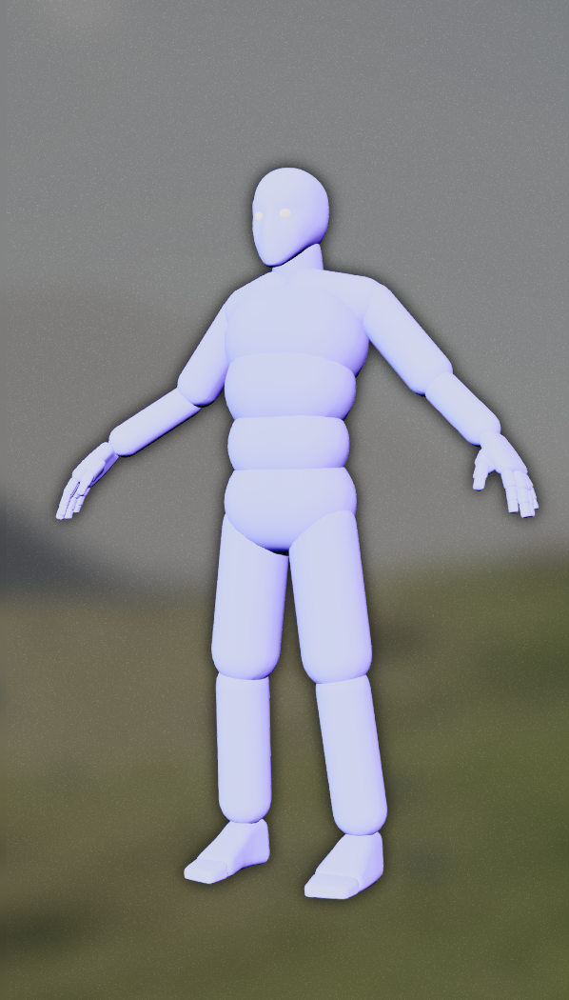

# UMG3dRenderWidget

The `UMG3dRenderWidget` plugin provides the bridge between the `PocketWorlds` plugin from Epic (available in **Lyra**) and UE projects. This allows for adding 3d views of whole levels in a normal UMG widget.

## Usage

1. Create a blueprint of the `PocketCapture` class. It will hold `PocketWorlds`-specific configuration for rendering. In a typical setting, all properties can be kept at their default values. For more information, please take a look at `PocketWorlds` plugin documentation.
1. Create a subclass of the `PocketLevelStageManager` actor. `PocketLevelStageManager` is an actor that holds view capture configuration, like camera settings or capture masks. Most of these settings can be set directly in the level, but two should be set as default values in the subclass:
    * **PocketCaptureClass**: The class of the `PocketCapture` blueprint created in the previous step.
    * **ActorAlphaMask**: Material used by actors when rendering the _alpha mask_. Typically, some parts of the captured image should be masked out, e.g. a character in an inventory view should not have a background. Alpha mask is captured by rendering the stage with the **ActorAlphaMask** overriding actor materials, thus giving the ability to render actors with custom opacity, while having the background transparent. Creating a simple material with white output will result in actors not being masked out. 
1. Create a level which should be displayed in a widget.
1. Add the stage manager created previously to the level and modify its settings to your liking for given level. The most important ones are camera settings, which should be positioned where desired.
1. Add actors, which should be captured, as children of the stage manager. For reasons explained later, it's recommended to add a widget encompassing the whole scene acting as a background (e.g. a black sphere) along with lights using a _different_ channel than the main game one. The background actor should be added to the `ExcludedFromAlphaMask` array in the stage manager if the background should not be visible in the resulting capture.

1. Create a Data Asset of type `TaggedPocketLevel`. Set a tag which will be associated with the level when choosing what to render, the level reference itself and its roughly approximated bounds.
1. Create a material, which will contain the captured level and can be used as an input for e.g. image widgets. Set its domain to _User Interface_ and blend mode to _AlphaComposite (Premultiplied Alpha)_. Add two texture sample parameters for color (named _Diffuse_) and alpha (named _AlphaMask_), as shown below:

1. In UMG editor create a subclass of the `PocketLevelWidget` and add an image widget inside. Set the brush of the image to the material created previously. Ideally, set its size to the capture size configured in the stage manager.
1. Set its `PocketLevel` to the `TaggedPocketLevel` Data Asset created previously, `CameraRenderMaterial` to the material created previously and `DesiredSpawnPoint` to a point very far from the normal play area. The levels to be captured (there can be many for different captures) will be spawned at that point and use the configured bounds to avoid intersecting each other. In order to not interfere with normal game lighting, captured levels should use their own lighting channels.
1. The created widget will contain the rendered level and can be added to the UI.

